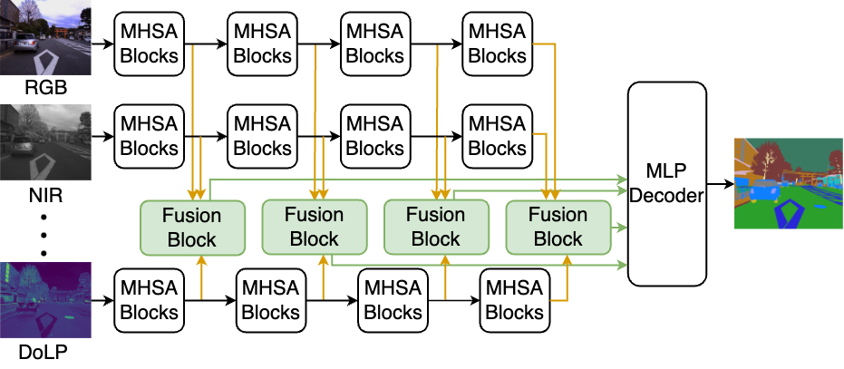
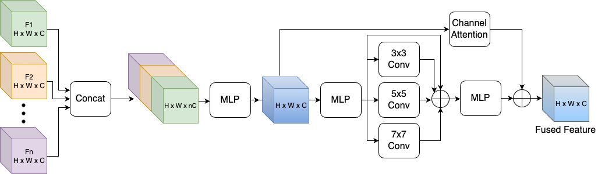

<div align="center"> 

## MMSFormer: Multimodal Transformer for Material Segmentation

</div>


[](https://paperswithcode.com/sota/semantic-segmentation-on-mcubes?p=multimodal-transformer-for-material)
<a href="https://arxiv.org/pdf/2309.04001">
    
</a>
<a href="https://pytorch.org/">
    
</a>

## Introduction

Leveraging information across diverse modalities is known to enhance performance on multimodal segmentation tasks. However, effectively fusing information from different modalities remains challenging due to the unique characteristics of each modality. In this paper, we propose a novel fusion strategy that can effectively fuse information from different combinations of four different modalities: RGB, Angle of Linear Polarization (AoLP), Degree of Linear Polarization (DoLP) and Near-Infrared (NIR). We also propose a new model named **M**ulti-**M**odal **S**egmentation Trans**Former** **(MMSFormer)** that incorporates the proposed fusion strategy to perform multimodal material segmentation. MMSFormer achieves 52.05% mIoU outperforming the current state-of-the-art on Multimodal Material Segmentation (MCubeS) dataset. For instance, our method provides significant improvement in detecting gravel (+10.4%) and human (+9.1%) classes. Ablation studies show that different modules in the fusion block are crucial for overall model performance. Furthermore, our ablation studies also highlight the capacity of different input modalities to improve performance in the identification of different types of materials. Our code and pretrained models are publicly available for reference. 

For more details, please check our [arXiv](https://arxiv.org/abs/2309.04001) paper.

## Updates
- [x] 09/2023, init repository.
- [x] 09/2023, release the code for MMSFormer.
- [x] 09/2023, release MMSFormer model weights. Download from [**GoogleDrive**](https://drive.google.com/drive/folders/1gYciyPj5VvE1AJcuYA8JGmWh61OF3asH?usp=sharing).

## MMSFormer model

<div align="center"> 


**Figure:** Overall architecture of MMSFormer model.


**Figure:** Proposed multimodal fusion block. 
</div>

## Environment

First, create and activate the environment using the following commands: 
```bash
conda env create -f environment.yaml
conda activate mmsformer
```

## Data preparation
Download the dataset:
- [MCubeS](https://github.com/kyotovision-public/multimodal-material-segmentation), for multimodal material segmentation with RGB-A-D-N modalities.

Then, put the dataset under `data` directory as follows:

```
data/
├── MCubeS
│   ├── polL_color
│   ├── polL_aolp
│   ├── polL_dolp
│   ├── NIR_warped
│   └── SS
```

## Model Zoo

### MCubeS
| Model-Modal      | mIoU   | weight |
| :--------------- | :----- | :----- |
| MMSFormer-RGB       | 50.07 | [GoogleDrive](https://drive.google.com/drive/folders/18WXcJxfJsK_0UzKTYENdQaaEFWDo6xW6?usp=sharing) |
| MMSFormer-RGB-A     | 51.28 | [GoogleDrive](https://drive.google.com/drive/folders/18WXcJxfJsK_0UzKTYENdQaaEFWDo6xW6?usp=sharing) |
| MMSFormer-RGB-A-D   | 51.57 | [GoogleDrive](https://drive.google.com/drive/folders/18WXcJxfJsK_0UzKTYENdQaaEFWDo6xW6?usp=sharing) |
| MMSFormer-RGB-A-D-N | 52.05 | [GoogleDrive](https://drive.google.com/drive/folders/18WXcJxfJsK_0UzKTYENdQaaEFWDo6xW6?usp=sharing) |


## Training

Before training, please download [pre-trained SegFormer](https://drive.google.com/drive/folders/1Gx0DCwfsyoRs1pHAS6KksoGBdZEHxcE3?usp=sharing), and put it in the correct directory following this structure:

```text
checkpoints/pretrained/segformer
├── mit_b2.pth
└── mit_b4.pth
```

To train MMSFormer model, please change the `configs/mcubes_rgbadn.yaml` file with appropriate paths and hyper-parameters. 

```bash
cd path/to/MMSFormer
conda activate mmsformer

python -m tools.train_mm --cfg configs/mcubes_rgbadn.yaml
```


## Evaluation
To evaluate MMSFormer models, please download respective model weights ([**GoogleDrive**](https://drive.google.com/drive/folders/18WXcJxfJsK_0UzKTYENdQaaEFWDo6xW6?usp=sharing)) as:


```text
output/
├── MCubeS
│   ├── MMSFormer_MiT_B2_MCubeS_RGB.pth
│   ├── MMSFormer_MiT_B2_MCubeS_RGBA.pth
│   ├── MMSFormer_MiT_B2_MCubeS_RGBAD.pth
│   ├── MMSFormer_MiT_B2_MCubeS_RGBNAD.pth
```

Then, modify `configs/mcubes_rgbadn.yaml` file, and run:

```bash
cd path/to/MMSFormer
conda activate mmsformer

python -m tools.val_mm --cfg configs/mcubes_rgbadn.yaml
```

## License

This repository is under the Apache-2.0 license. For commercial use, please contact with the authors.


## Citations

If you use MMSFormer model, please cite the following work:

- **MMSFormer** [[**arXiv**](https://arxiv.org/abs/2309.04001)]
```
@misc{reza2023multimodal,
      title={Multimodal Transformer for Material Segmentation}, 
      author={Md Kaykobad Reza and Ashley Prater-Bennette and M. Salman Asif},
      year={2023},
      eprint={2309.04001},
      archivePrefix={arXiv},
      primaryClass={cs.CV}
}
```

## Acknowledgements
Our codebase is based on the following Github repositories. Thanks to the following public repositories:
- [DELIVER](https://github.com/jamycheung/DELIVER)
- [RGBX-semantic-segmentation](https://github.com/huaaaliu/RGBX_Semantic_Segmentation)
- [Semantic-segmentation](https://github.com/sithu31296/semantic-segmentation)

**Note:** This is a research level repository and might contain issues/bugs. Please contact the authors for any query.
